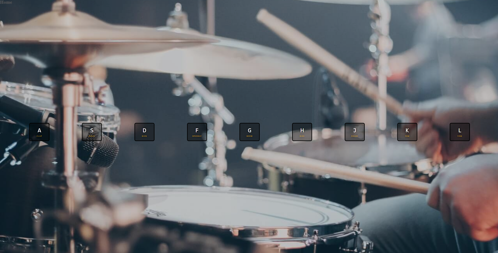



# JavaScript30

A 30 day challenge in vanilla JavaScript found at [https://JavaScript30.com](https://JavaScript30.com)

## 01: Drum Kit

A simple drumkit which plays the sound described on each key.  
Each key square on screen when pressed flashes yellow and slightly enlarges when pressed. 

